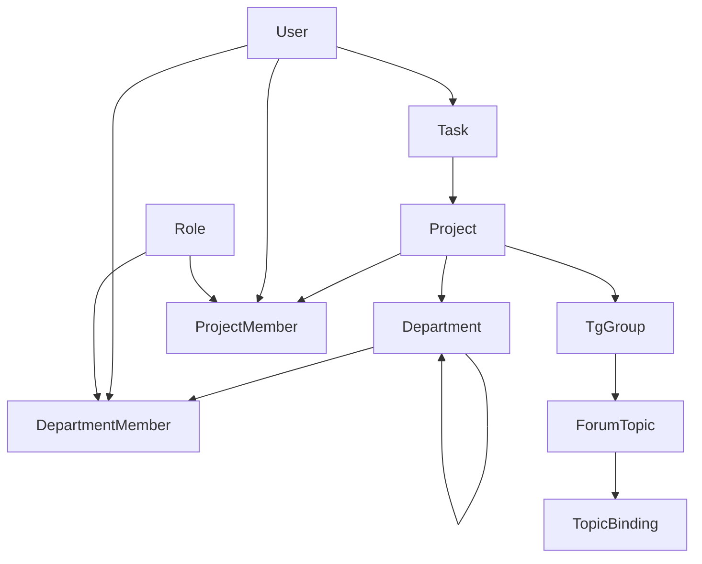

# 🤖 Telegram Bot with Django Admin Panel

Полнофункциональный Telegram бот с административной панелью Django для управления задачами, проектами и командами.

## 📋 Оглавление
- [Возможности](#-возможности)
- [Архитектура](#-архитектура)
- [Установка](#-установка)
- [Настройка](#-настройка)
- [Использование](#-использование)
- [Команды бота](#-команды-бота)
- [Админ-панель](#-админ-панель)
- [API и интеграции](#-api-и-интеграции)
- [Разработка](#-разработка)
- [Тестирование](#-тестирование)

## ✨ Возможности

### Telegram Bot
- 📝 **Управление задачами** - создание, назначение, отслеживание статуса
- 📅 **Умные дедлайны** - парсинг дат на русском языке ("завтра", "через неделю")
- 👥 **Командная работа** - автоматическое назначение через департаменты и роли
- 🔄 **Синхронизация** - автоматическая синхронизация участников групп
- 📊 **Отслеживание** - история изменений и активности

### Django Admin
- 🏢 **Проекты** - управление множественными проектами
- 👨‍💼 **Департаменты** - двухуровневая иерархия подразделений
- 🎭 **Роли** - гибкая система прав доступа
- 📈 **Отчеты** - статистика по задачам и участникам
- 🎨 **UI/UX** - кастомизированный интерфейс с каскадными селектами

### Технические особенности
- 🚀 **Производительность** - Redis кэширование для оптимизации
- 🔒 **Безопасность** - разграничение прав доступа
- 📦 **Docker** - полная контейнеризация
- 🧪 **Тесты** - покрытие основного функционала

## 🏗 Архитектура

```
tg-bot/
├── bot/                    # Telegram bot (aiogram 3.x)
│   ├── main.py            # Основная логика бота
│   ├── handlers/          # Обработчики команд
│   │   └── calendar.py    # Календарь для выбора дат
│   └── services/          # Вспомогательные сервисы
│       └── datetime.py    # Парсинг дат
│
├── admin/                 # Django админ-панель
│   ├── core/             # Основное приложение
│   │   ├── models.py     # Модели данных
│   │   ├── admin.py      # Настройки админки
│   │   └── templates/    # Кастомные шаблоны
│   └── settings.py       # Настройки Django
│
├── tests/                # Тесты
├── docker-compose.yml    # Оркестрация контейнеров
└── .env.example         # Пример переменных окружения
```

### Модели данных



## 🚀 Установка

### Требования
- Docker и Docker Compose
- Python 3.12+
- PostgreSQL 15+
- Redis 7+

### Быстрый старт

1. **Клонируйте репозиторий:**
```bash
git clone https://github.com/osvayder/tg-bot.git
cd tg-bot
```

2. **Настройте переменные окружения:**
```bash
cp .env.example .env
# Отредактируйте .env и добавьте ваш BOT_TOKEN
```

3. **Запустите через Docker Compose:**
```bash
docker-compose up -d
```

4. **Выполните миграции:**
```bash
docker-compose exec admin python manage.py migrate
```

5. **Создайте суперпользователя:**
```bash
docker-compose exec admin python manage.py createsuperuser
```

## ⚙️ Настройка

### Переменные окружения (.env)

```env
# Telegram Bot
BOT_TOKEN=your_bot_token_here
SHADOW_MODE=false
TIMEZONE=Europe/Moscow

# Database
DB_HOST=db
DB_PORT=5432
DB_NAME=botdb
DB_USER=bot
DB_PASSWORD=secure_password

# Redis
REDIS_HOST=redis
REDIS_PORT=6379
REDIS_DB=0

# Django Admin
SECRET_KEY=your_secret_key_here
DEBUG=False
ALLOWED_HOSTS=localhost,127.0.0.1
```

### Настройка бота в Telegram

1. Создайте бота через [@BotFather](https://t.me/botfather)
2. Получите токен и добавьте в `.env`
3. Настройте команды через BotFather:
```
start - Запустить бота
whoami - Информация о пользователе
ping - Проверка связи
checklast - Выбрать задачи из последних сообщений
add - Создать новую задачу
syncmembers - Синхронизировать участников группы
```

## 📱 Использование

### Команды бота

#### `/start`
Инициализация бота и проверка работоспособности.

#### `/whoami`
Показывает информацию о текущем пользователе, его ролях и проектах.

#### `/ping`
Проверка связи с ботом и базой данных.

#### `/checklast N`
Выбор задач из последних N сообщений в чате:
- Интерактивный выбор через чекбоксы
- Автоматическое определение ответственных
- Парсинг дедлайнов из текста

Пример:
```
/checklast 10
```

#### `/add [задача]`
Создание новой задачи:
- Поддержка inline-режима
- Выбор дедлайна через календарь
- Автоматическое назначение ответственного

Примеры:
```
/add Подготовить отчет до завтра
/add @username Проверить документацию через неделю
```

#### `/syncmembers`
Синхронизация участников группы с проектом:
- Автоматическое создание пользователей
- Назначение ролей по умолчанию
- Обновление существующих участников

### Парсинг дат

Бот понимает даты на русском языке:
- "сегодня", "завтра", "послезавтра"
- "через час", "через 2 дня", "через неделю"
- "в понедельник", "в пятницу"
- "15 марта", "1 января 2025"
- "15.03", "01.01.2025"
- "в 14:00", "завтра в 10:30"

## 🎛 Админ-панель

### Доступ
```
http://localhost:8000/admin/
```

### Основные разделы

#### Проекты
- Создание и управление проектами
- Привязка Telegram групп
- Настройка департаментов
- Управление участниками

#### Департаменты
- Двухуровневая иерархия
- Автоматическое наследование проекта
- Каскадное назначение участников
- Ведущие роли

#### Пользователи
- Интеграция с Telegram
- Множественные роли
- Участие в департаментах
- История активности

#### Задачи
- Статусы: TODO, IN_PROGRESS, ON_REVIEW, DONE, ARCHIVED
- Дедлайны с предупреждениями
- Привязка к сообщениям
- Отслеживание источника

### Особенности UI

1. **Каскадный выбор департаментов**
   - Автоматическая фильтрация поддепартаментов
   - Групповое назначение

2. **Умная фильтрация участников**
   - Показ только релевантных пользователей
   - Быстрый поиск

3. **Визуальные индикаторы**
   - Цветовая индикация статусов
   - Предупреждения о дедлайнах
   - Счетчики и метрики

## 🔌 API и интеграции

### TopicBinding
Автоматическое назначение ответственных по топикам:

```python
# Приоритет назначения:
1. Конкретный пользователь
2. Роль в проекте  
3. Департамент (lead_role → tech → первый участник)
```

### Redis кэширование
- TTL 5 минут для resolver'а ответственных
- Кэширование частых запросов
- Оптимизация производительности

### Webhook (планируется)
Для production рекомендуется настроить webhook вместо polling.

## 🛠 Разработка

### Локальная разработка

1. **Без Docker:**
```bash
# Установка зависимостей
pip install -r bot/requirements.txt
pip install -r admin/requirements.txt

# Запуск бота
python bot/main.py

# Запуск админки
python admin/manage.py runserver
```

2. **Hot-reload в Docker:**
```bash
docker-compose up --build
```

### Структура кода

#### Bot (aiogram 3.x)
- Использует FSM для сложных сценариев
- Асинхронная обработка
- Middleware для логирования

#### Admin (Django 5.0)
- Class-based views
- Custom admin actions
- Signal handlers

### Git Workflow

```bash
# Создание фичи
git checkout -b feature/new-feature

# Коммит изменений
git add .
git commit -m "feat: add new feature"

# Отправка на GitHub
git push origin feature/new-feature
```

### Commit Convention
- `feat:` - новая функциональность
- `fix:` - исправление багов
- `docs:` - документация
- `style:` - форматирование
- `refactor:` - рефакторинг
- `test:` - тесты
- `chore:` - рутинные задачи

## 🧪 Тестирование

### Запуск тестов

```bash
# Все тесты
docker-compose exec bot pytest

# Конкретный тест
docker-compose exec bot pytest tests/test_datetime_parse.py

# С покрытием
docker-compose exec bot pytest --cov=.
```

### Тестовые сценарии

1. **S0 - Базовый функционал**
   - Создание задач
   - Назначение ролей
   - Управление проектами

2. **S1 - Расширенный функционал**
   - TopicBinding
   - Маршрутизация сообщений
   - Синхронизация участников

### Smoke тесты

```bash
# Проверка бота
/start
/ping
/whoami

# Проверка админки
curl http://localhost:8000/admin/
```

## 📊 Мониторинг

### Логи

```bash
# Все логи
docker-compose logs -f

# Только бот
docker-compose logs -f bot

# Только админка
docker-compose logs -f admin
```

### Метрики
- Количество обработанных сообщений
- Время ответа
- Ошибки и исключения

## 🚢 Deployment

### Production настройки

1. **Используйте webhook вместо polling**
2. **Настройте SSL сертификаты**
3. **Включите логирование в файлы**
4. **Настройте бэкапы БД**
5. **Используйте отдельный Redis для кэша и сессий**

### Docker Swarm / Kubernetes

Проект готов к развертыванию в оркестраторах.

## 🤝 Вклад в проект

1. Fork репозитория
2. Создайте branch для фичи
3. Commit изменений
4. Push в branch
5. Создайте Pull Request

## 📝 Лицензия

MIT License - свободное использование

## 👥 Команда

- **osvayder** - Основной разработчик
- **Claude** - AI-ассистент

## 📞 Контакты

- GitHub: [@osvayder](https://github.com/osvayder)
- Telegram: @osvayder

## 🙏 Благодарности

- Aiogram community
- Django community
- Claude AI от Anthropic

---

**Последнее обновление:** 22 августа 2025

🤖 Generated with [Claude Code](https://claude.ai/code)

Co-Authored-By: Claude <noreply@anthropic.com>